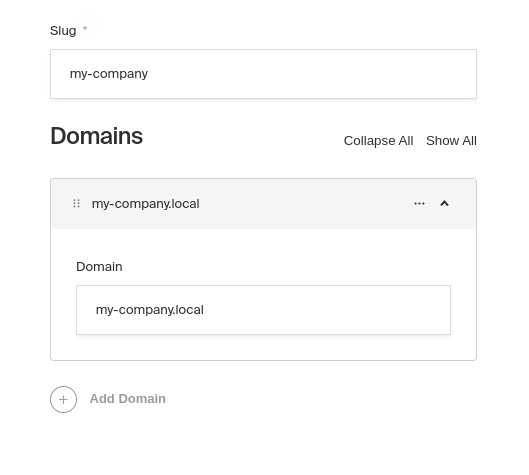

# Multi-tenancy plugin for Payload CMS

This plugin allows multiple tenants to access different resources in the same
instance of Payload CMS.

Tenants are an account to the single instance of application (server and
database) that make it seem like there's one application instances for each
tenant. Each tenant can have multiple users. In this case tenants are also
hierarchical, so tenants can also include other tenants.

## Table of contents

- [Features](#features)
- [Collections and fields](#collections-and-fields)
- [Tenant isolation strategies](#tenant-isolation-strategies)
- [Installation](#installation)
- [Initial setup](#initial-setup)
  - [Programmatic setup](#programmatic-setup)
  - [Manual setup](#manual-setup)

## Features

- **Tenant isolation**: Each tenant has it's own documents and only that tenant
  can access them.
- **Hierarchial tenant management**: Tenants have parents. Parent tenants can
  manage and access their children in a hierarchical manner.
- **Path mapping**: Each tenant can be mapped to its own path to separate login
  pages and to allow access to different tenants.
- **Domain mapping**: Each tenant can be mapped to its own domain to create
  clear separation between tenants.
- **Tested properly**: The project is tested thoroughly with unit tests, e2e
  tests and manual testing.

## Collections and fields

Here's description of collections used and fields that are added by this plugin.

- Tenant collection holds information about tenants. The collection is not added
  automatically, but some fields are added to it. Tenants can be managed in a
  hierarchial manner. You can access the tenant you belong to and it's
  sub-tenants.

  The name of the collection must be either "tenants" or defined in plugin's
  factory function. In example below, tenant collection is named
  "organizations".

  ```javascript
  export default buildConfig({
    plugins: [tenancy({ tenantCollection: "organizations" })],
    collections: [Users, Organizations],
    // ...rest of the config...
  });
  ```

  - Tenant's slug field contains URL friendly name of the tenant. Slug is
    required and is used for identifying the tenant from URL path if path
    isolation is in use.

  - Tenant's domains are optional and are used for identifying the tenant by
    hostname in domain isolation mode.

- User collections have a tenant field that connects users to some tenant. The
  tenant field is required to have relation to some existing tenant. Users can
  be accessed in a hierarchial manner, so that all above tenants see users in
  that tenant and below.

- Other collections are called resource collections because they are resources
  of one tenant. They also have a hidden tenant field that must relate to an
  existing tenant. Documents of resource collections can by default be only
  accessed from the tenant owning those documents determined by path or domain
  or an user belonging to the tenant when using "user" isolation strategy. Users
  above in tenant hierarchy can login to tenants below and access resource
  collections that way.

## Tenant isolation strategies

There is a few different strategies to choose from to isolate tenants from each
other.

- **"user" strategy**: All users log in to the same address (URL) and can access
  their own tenant after logging in. There's no way to isolate publicly
  available content between tenants.

- **"path" strategy**: All tenants have different base path for their "section"
  of the installation. Admin panel, Rest API, and GraphQL API are all under that
  base path and access different content. The path to admin panel would be for
  example "/my-company/admin".

- **"domain" strategy**: All tenants have their own domains. And appear as
  completely different installations for users although they are controlled by
  single server (or load-balanced cluster). For this to work tenant must have at
  least one domain set and the name service must point to correct location where
  you are hosting the application.

You can set the strategy to plugin's factory function. In example below,
"domain" strategy is used.

```javascript
export default buildConfig({
  plugins: [tenancy({ isolationStrategy: "domain" })],
  collections: [Users, Tenants],
  // ...rest of the config...
});
```

## Installation

1. Ensure you have at least one authentication-enabled collection.
2. Create tenant collection. Use slug "tenants" or configure other slug in the
   following step.

```javascript
export const Tenants: CollectionConfig = {
  slug: "tenants",
  admin: {
    useAsTitle: "name",
  },
  fields: [
    {
      type: "text",
      name: "name",
      label: "Name",
      required: true,
    },
  ],
};
```

3. Import and add the plugin to your Payload config.

```javascript
export default buildConfig({
  plugins: [tenancy()],
  collections: [Users, Tenants],
  // ...rest of the config...
});
```

## Initial setup

Initial setup can be done in at least two different ways that are described
below. To complete initial setup there must be at least one tenant and one user.

### Programmatic setup

Setup can be done programmatically using Local API. Just make sure there's at
least one tenant and one user that are related to each other by tenant field in
user document.

```javascript
const myTenant = await payload.create({
  collection: "tenants",
  data: {
    slug: "my-company",
    domains: [{ domain: "my-company.local" }],
  },
});

await payload.create({
  collection: "users",
  data: {
    email: "me@my-company.local",
    password: "secret",
    tenant: myTenant.id,
  },
});
```

### Manual setup

Setup can be done through admin panel using "user" isolation strategy which is
the default strategy. First, when you arrive to admin panel when there's no
users registered yet, you are greeted with normal Payload's "create first user"
form.


After creating the first user the dashboard shows only the tenant collection.
That's because the root tenant must be created at this stage.


Tenant form has fields for slug and domains. Slug is required and is used for
identifying the tenant from URL path if path isolation is in use. Domains are
optional and are used for identifying the tenant by hostname in domain isolation
mode.



After creating the root tenant, other collections show and you are free to
create other users, tenants or resources owned by the tenant. Setup has been
completed.
